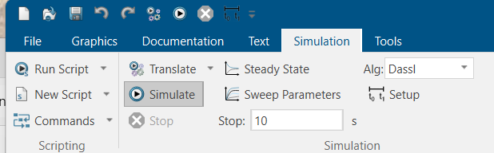

# Open and Simulate in Dymola

The output files from the translation are located in the <>output' folder can be opened in any Modelica IDE. [Dymola](https://dymola.com/) will be used for this example.


## Before you start

Make sure that:
- You have cloned the [repository](https://github.com/alSETLab/XSLTConferencePaper/).
- Install [Dymola](https://discover.3ds.com/free-trial-version-of-dymola-for-windows). To complete the steps below successfully you will need to have a license, you can get one [here](https://www.claytex.com/about-us/contact-us/).
- Download the OpenIPSL library version 3.0.1 from this [link](https://github.com/OpenIPSL/OpenIPSL/releases/tag/v3.0.1). Uncrompress the .zip file and place it in a folder where you have read/write rights, e.g., <code>./Documents/Dymola/</code>

## Load and ``Check'' the Model

Before simulating a Modelica model, it is necessary to determine if the model is sytactically and sematically valid. This is carried out below for a test model.

1. Open Dymola

   ```bash
    Start -> All apps -> Dymola 2024x
   ```

2. Load the OpenIPSL library

   ```bash
    File -> Open -> Load...
   ```
   
   

   Browse to the location where you have saved OpenIPSL. Selecte the <code>package.mo</code>, from <code> ./YourFolderWithOpenIPSL/OpenIPSL/package.mo </code> file and click on <code>Open</code>.

   


3. Load the <code>ieee14.mo</code> file
   ```bash 
   File -> Open -> Load...
   Find 'ieee14.mo' in the 'XSLTConferencePaper/output' folder.
   ```

4. Locate the <code>ieee14_package</code> under the 'Projects Browser' of Dymola. Tip it over and double-click 'ieee14'.

   

5. Click on the 'Graphics' tab of Dymola, then click the 'Check' button, which should show the message below:

   

## Simulate
Having passed the check, you can now attempt to simulate the model.

1. Navigate to the 'Projects Browser' of Dymola, right click on the <code>ieee14</code> model and select 'Simulation Model'

   

2. Click on the 'Simulation' tab of Dymola, and click on the 'Simulate' icon.

   

3. After the simulation is completed, select a few simulation outputs as shown below. Note that the fault applied results in an unstable system!

   

Have fun playing around with the model!