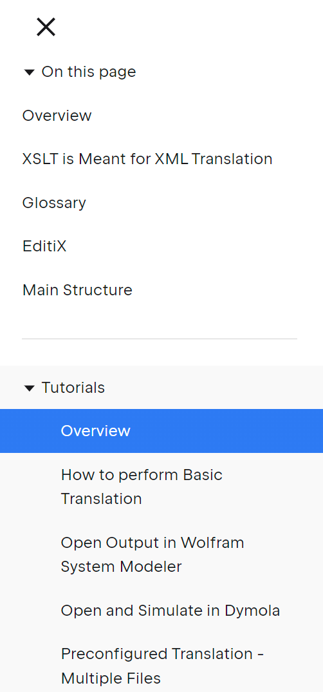

# Tutorials
Interactive CGMES XML translation to OpenIPSL using XSLT running in EditiX.

### Overview
For background information and an overview of the goals of this prototype tool, please refer to the article:
> G. K. Halley, L. Vanfretti and M. de Castro, “Interactive Model Transformations from the Common Information Model (CIM) to Modelica,” 2024 9th International Conference on Smart and Sustainable Technologies 2024 (SpliTech), June 25-28, 2024, Split-Bol, Croatia.

A pre-print is available on ResearchGate, [here](https://www.researchgate.net/publication/381039589_Interactive_Model_Transformations_from_the_Common_Information_Model_CIM_to_Modelica).

### Requirements
Editix is an interactive development environment for XML/XSLT:
[https://www.editix.com/](https://www.editix.com/)

Version 2023 - Build 010123 is used, it can be downloaded [here](https://www.editix.com/#download) and used free-of-charge for 30 days.

This tutorial will use the features of EditiX to analyze CGMES XML and lcoated the parameters necessary to load into OpenIPSL. While editing XML, it also allows quick and clear separation of components into files that show up as tabs.

### Where to start?
- Click on the menu icon on top of the page, next to "Tutorial 1.0" 

- This will open the tutorial sections that you can navigate through. You can access any of these sections by clicking on the menu icon.

- Start by click on the "Overview" page, and continue in sequential order.
- Enjoy!